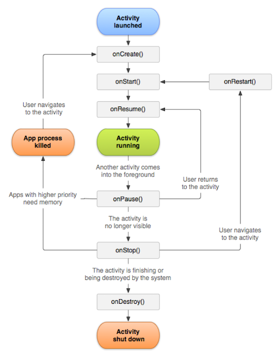

# Activity Lifecycle

## Application Overview

### Application Components
- Every application is composed of one or more of the following application components
    - Activities
    - Services - background process
    - Content providers - stores and receives data
    - Broadcast Receivers - receive messages
- Activated by intents
- Must be declared in the manifest

## Activities

- An activity is a single, focused thing that the user can do
- Usually associated with a view
- Examples
  - Play a game
  - Edit a note
- Your project must have at least one Activity
- A separate activity is associated with each screen of an app
- The purpose of an activity is to control what is displayed on the screen
- All activities extend [`android.app.Activity`](http://developer.android.com/reference/android/app/Activity.html)
- The entry point is the `onCreate()` method

### onCreate Method
- It must invoke the super class method `super.onCreate(savedInstanceState)`;
- It's almost always overridden to initialize the activity
- Invokes the `setContentView` method to specify the user interface
  - Example	`setContentView(R.layout.main);`
- Each Activity may have one and only one content view
  - Once set it can't be changed

## Activity Life Cycle
- An Activity can be
  - Active (or running):  visible on the screen and has focus
  - Paused:  visible on the screen but doesn't have the focus
  - Stopped:  not visible on the screen and likely to be killed by the system when its memory is needed

### Process Stack
- Every process running on the Android platform is placed on a stack
- When an activity has focus, it is placed at the top of the stack
- Android tries to keep processes running as long possible
- The Android OS decides when processes are killed

### Activity Life Cycle
- Every activity in an application goes through its own lifecycle
- When an activity transitions into and out of the different states, it is notified through callback methods.

### Life cycle callback methods
- `onCreate()` is called when the Activity is created
- `onStart()` is called immediately after `onCreate` or if the Activity is being restarted
- `onResume()` is called after onCreate and onStart
- `onPause()` is called when the activity is pausing
- `onStop()` is called to stop the activity and transition it to a non-visible phase
- `onDestroy()` is called when an activity is being completely removed from system memory

## Logging Messages using the `Log` Class
- Use static methods of the Log class to add messages to the log.
  - Info:  `Log.i`
  - Debug: `Log.d`
  - Warn: `Log.w`
  - Error: `Log.e`
  - Verbose: `Log.v`
- Each message includes a tag and a message
  - The tag can be used to filter out your messages
- These messages can be viewed in the LogCat

## Saving State

- When an Activity object is destroyed the system cannot resume it with its state intact.
- Use the `onSaveInstanceState` callback method in order to save the current state of an Activity
  - Saves the contents of the app's UI components
  - Can be overridden to save additional values

### Bundles
- State is saved in a `Bundle`
  - A mapping from String values to types
- Additional information can be saved as name-value pairs

### Restoring a Saved State
- When restoring an application, the system recreates the activity and passes the Bundle to `onCreate()` and `onRestoreInstanceState()`
- In either of these methods, you can extract your saved state from the Bundle and restore the activity state
