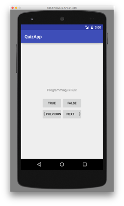
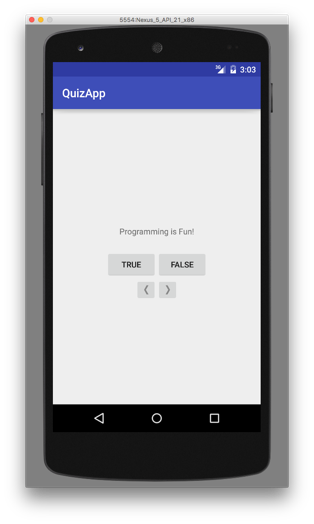

# Quiz App Assignment

### Requirements for this assignment:

1. Clone this repository to your computer.
2.  Follow the instructions from lecture to create the Quiz app.  Be sure to save or move the Android project to the folder that was created when you cloned this repository.
3. Add a previous button that takes the user back one question.  If they are currently on the first question, pressing this button will cause the last question to be displayed.   Your completed application should look like this when it runs:

## Extra credit (2 points)

Change previous and next buttons to ImageButtons.  This requires that you change the element in the XML layout file from Button to ImageButton and use the appropriate attributes to display an image.  You must also modify the controller to reflect the change to ImageButton.  You can find additional information on how to use image buttons in the [Android API](https://developer.android.com/reference/android/widget/ImageButton).

*You cannot earn extra unless the basic assignment is correct.*

### Grading

This assignment is worth **10 points**

Your assignment will be evaluated based on the following rubric:
- Basic application completed during class works correctly: 5 pts.
- Button with correct label and image  is added in the appropriate location to the layout: 2 pts.
- Previous button displays previous question and does not cause application to crash: 3 pts.
